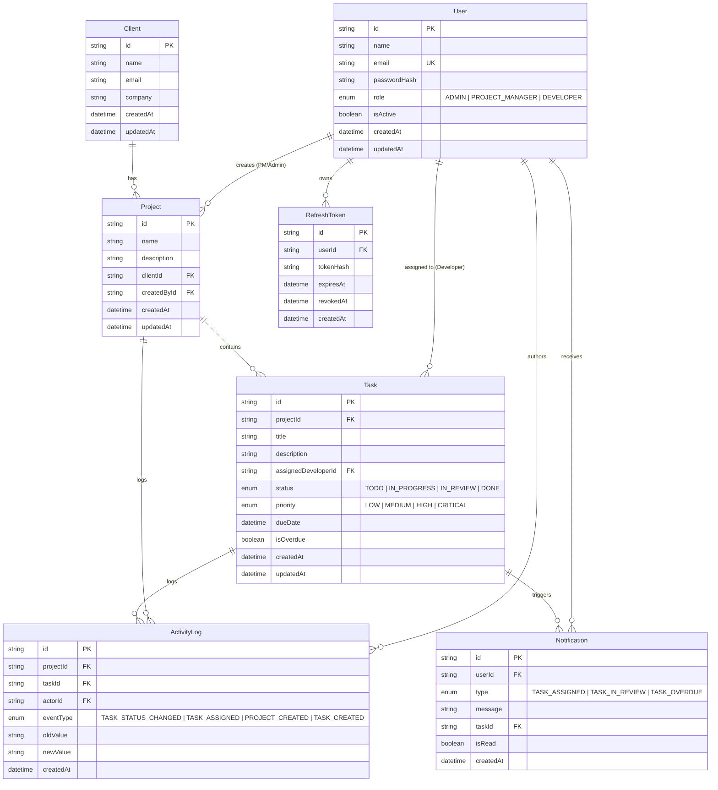

# Velozity Global Solutions - Production-Level Project Blueprint

## Real-Time Client Project Dashboard with RBAC & Live Activity Feed

> **Assessment Context & Blueprint Reference**: This document serves as the single source of truth for the project requirements, architecture, data model, security, REST APIs, Socket.IO realtime events, background jobs, test matrix, and submission checklist for all AI agents and developers.

---

## 1. Quick Reference & Core Technology Stack

| Layer                  | Technology                                                      | Purpose                                                             |
| ---------------------- | --------------------------------------------------------------- | ------------------------------------------------------------------- |
| **Frontend**           | React + TypeScript + Vite                                       | UI Framework and type safety                                        |
| **Routing**            | React Router                                                    | Role routes and URL query parameter state                           |
| **Server State**       | TanStack Query                                                  | Caching, invalidation, loading/error states                         |
| **Forms & Validation** | React Hook Form + Zod                                           | Low-overhead form handling with shared typed validation schemas     |
| **UI & Components**    | Tailwind CSS + shadcn/ui + Lucide React                         | Clean B2B SaaS dashboard, accessible components, consistent icons   |
| **Dates**              | date-fns                                                        | Relative times, due dates, date ranges                              |
| **HTTP Client**        | Axios / Fetch wrapper                                           | REST calls with automatic access-token retry on 401                 |
| **Realtime Client**    | `socket.io-client`                                              | Authenticated WebSocket client                                      |
| **Backend**            | Node.js + Express + TypeScript                                  | Modular, layered API server                                         |
| **Database & ORM**     | PostgreSQL + Prisma ORM (or parameterized SQL migrations)       | Normalized relational schema, foreign keys, and indexes             |
| **Realtime Server**    | Socket.IO                                                       | WebSocket rooms, role/project authorization, presence               |
| **Auth & Security**    | JWT (`jose` / `jsonwebtoken`) + `argon2`                        | Short-lived access token + HttpOnly cookie refresh token rotation   |
| **Middleware**         | `helmet`, `cors`, `cookie-parser`, `express-rate-limit`, `pino` | Security headers, cookie parsing, rate limiting, structured logging |
| **Scheduler**          | `node-cron`                                                     | Periodic overdue task evaluation                                    |
| **Testing**            | Vitest / Jest + Supertest + Playwright                          | Unit/API integration tests & E2E browser tests                      |
| **Dev & Containers**   | Docker + Docker Compose                                         | Reproducible local setup                                            |

---

## 2. Evaluation Criteria & Auto-Disqualification Risks

### Evaluation Breakdown

1. **Role-Based Access Control (25%)**: Enforce strictly at API & database level plus resource ownership checks. Never rely on hidden UI alone.
2. **Real-Time Feed (25%)**: WebSocket updates must be role-filtered, persisted first, and support missed-event catch-up from PostgreSQL upon reconnect.
3. **Database Design (20%)**: Normalized schema, foreign keys, indexes, and clear entity relations.
4. **Code Architecture (20%)**: Clear layer separation (routes, controllers, services, repositories, socket handlers, middleware).
5. **Seed / README / Setup (10%)**: Deterministic seed data across all roles, comprehensive documentation, and architectural justifications.

### Auto-Disqualification Risks to Avoid

- ❌ Frontend-only role restrictions (must reject unauthorized API calls with 401/403/404).
- ❌ Polling / Server-Sent Events (SSE) instead of Socket.IO WebSockets.
- ❌ Missing seed script (must seed 1 Admin, 2 PMs, 4 Developers, projects, tasks, overdue items, activity).
- ❌ Plain JavaScript instead of strict TypeScript.
- ❌ Random raw SQL scattered inside HTTP controllers (must be isolated in repositories / services).
- ❌ Hardcoded secrets in code or git.
- ❌ Missing refresh-token rotation / storing refresh token in `localStorage`.

---

## 3. Recommended Build Order

1. **Project Skeleton & Environment Validation**: Monorepo/workspaces structure, TypeScript configs, Zod environment validation.
2. **Database Schema & Migrations**: Normalized PostgreSQL tables, foreign keys, constraints, and composite indexes.
3. **Seed Script**: Deterministic population of Admin, PMs, Developers, Clients, Projects, Tasks, and ActivityLogs.
4. **Authentication & Refresh-Token Rotation**: Argon2 password hashing, short-lived access JWT, HttpOnly refresh cookie with hashed DB storage.
5. **RBAC & Resource Ownership Middleware**: Strict route guards for Admin, PM (own projects), and Developer (assigned tasks).
6. **Client & Project APIs**: CRUD endpoints with role-aware scoping.
7. **Task APIs & URL Filters**: Task management with status, priority, and date range filters via URL query params.
8. **Atomic Task-Status Update + Activity Log**: Single DB transaction updating task status, creating an activity log, and generating PM notifications when status transitions to `IN_REVIEW`.
9. **Socket.IO Authentication & Rooms**: Connection handshake token verification, joining `user:{id}`, `role:admin`, `pm:{pmId}`, `developer:{devId}`, and authorized `project:{id}` rooms.
10. **Realtime Feed & Missed-Event Catch-up**: Emitting events only _after_ DB commit; `GET /api/activities/catchup?after=<timestamp>` recovering missed events.
11. **Notifications & Unread Badge**: Persistent DB notifications + live badge increment/decrement.
12. **Presence / Active Users Online**: Multi-tab per-user socket count broadcasted to authorized dashboards.
13. **Overdue Background Scheduler**: Idempotent `node-cron` job checking `dueDate < NOW()` and updating `isOverdue = true`.
14. **Role Dashboards & Polished UI**: Admin, PM, and Developer specific views with KPI cards, activity feeds, task drawers.
15. **Automated Integration & E2E Tests**: Comprehensive RBAC test matrix and Playwright browser tests.
16. **Docker & Local Setup**: Dockerfile and compose configuration.
17. **Deployment & Final Documentation**: Production deployment guide, architectural justifications in README.

---

## 4. Database Schema & Data Model Blueprint



### Essential Indexing Plan

- `User.email` (Unique lookup)
- `Project.createdById` (PM project ownership queries)
- `Project.clientId` (Client-project relationships)
- `Task.projectId` (Project task lists)
- `Task.assignedDeveloperId` (Developer task scoping)
- `Task.status`, `Task.priority`, `Task.dueDate` (Filter queries & scheduler)
- `(assignedDeveloperId, status)` (Developer dashboard query composite index)
- `(projectId, status)`, `(projectId, priority)` (Project task list composite indexes)
- `(projectId, createdAt)` (Activity feed pagination index)
- `(userId, isRead, createdAt)` (Notification query & unread count composite index)

---

## 5. Security & Authentication Architecture

### Authentication Flow

1. **Login (`POST /api/auth/login`)**:
   - Validate body (`email`, `password`) via Zod.
   - Verify user credentials with Argon2.
   - Issue short-lived access JWT (5–15 min TTL).
   - Generate cryptographically secure refresh token (7–30 days TTL), store **SHA-256 hash** in `RefreshToken` table.
   - Set refresh token as `HttpOnly`, `Secure`, `SameSite=Lax/Strict` cookie.
   - Return `{ accessToken, user }`.
2. **Token Refresh (`POST /api/auth/refresh`)**:
   - Read refresh token from HttpOnly cookie.
   - Hash token and lookup active, unrevoked record in database.
   - If invalid/revoked: detect potential reuse and reject session with 401.
   - Revoke old refresh token, generate and hash new refresh token (Rotation).
   - Return new short-lived access token and update cookie.
3. **Logout (`POST /api/auth/logout`)**:
   - Revoke DB refresh token record and clear cookie.

### Role Matrix & Authorization Rules

| Role                | Data Scope                                        | Activity Scope             | Key Actions                                                       |
| ------------------- | ------------------------------------------------- | -------------------------- | ----------------------------------------------------------------- |
| **Admin**           | Global (all clients, projects, tasks, users)      | Global activity            | Full CRUD on all resources, manage team, view active online users |
| **Project Manager** | Own projects (`createdById == user.id`)           | Activity on own projects   | Create/manage own projects, create/assign tasks in own projects   |
| **Developer**       | Assigned tasks (`assignedDeveloperId == user.id`) | Activity on assigned tasks | View assigned tasks, update task status                           |

- **Resource Ownership Rule**: If a PM attempts to edit another PM's project, or a Developer attempts to view/edit another Developer's task, return **404 Not Found** (or 403) to prevent ID probing.
- **Never trust client IDs in request bodies**: The authority for identity is always extracted from the verified JWT access token (`req.user.id`, `req.user.role`).

---

## 6. Real-Time Socket.IO Architecture

### Socket Connection & Room Model

- **Handshake Authentication**: Handshake includes the access token; server verifies JWT before allowing socket connection.
- **Base Rooms Joined on Connect**:
  - `user:{userId}` (Targeted personal notifications)
  - `role:admin` (Global admin broadcast)
  - `pm:{userId}` (Project Manager events)
  - `developer:{userId}` (Developer events)
- **Project Room Subscriptions (`project:{projectId}`)**:
  - Client sends `join-project(projectId)`.
  - Server **must authorize** against DB / ownership rules before calling `socket.join("project:" + projectId)`. Never trust client room joins blindly.

### Atomic Task Status Change & Event Flow

```
Developer updates task status (PATCH /api/tasks/:id/status)
  │
  ├─ 1. Authenticate & Authorize Developer ownership
  │
  ├─ 2. BEGIN DB TRANSACTION
  │     ├── UPDATE Task SET status = newStatus
  │     ├── INSERT INTO ActivityLog (task, actor, oldStatus, newStatus)
  │     └── IF (newStatus == 'IN_REVIEW') -> INSERT INTO Notification (for PM)
  │     COMMIT TRANSACTION
  │
  ├─ 3. EMIT Socket.IO Events (Only AFTER commit)
  │     ├── To "project:{projectId}": task:updated, activity:created
  │     └── To "user:{pmId}": notification:new (if IN_REVIEW)
  │
  └─ 4. Return HTTP 200 OK
```

### Missed-Event Catch-up

- When a client reconnects after network loss, it calls:
  `GET /api/activities/catchup?after=<lastSeenCreatedAt>&limit=20`
- Server queries database applying role-based scoping (Admin = global, PM = own projects, Developer = assigned tasks).
- Returns up to 20 missed events, which the frontend merges and deduplicates with live feed state.

### Presence Tracking

- Server maintains an in-memory map of `userId -> Set<socketId>` (or count).
- Single user with multiple browser tabs counts as **1 active user**.
- Emits `presence:update` with total online user count to authorized Admin users upon connect/disconnect.

---

## 7. Background Job (Overdue Tasks)

- Implemented via `node-cron` running every minute.
- Query:
  ```sql
  UPDATE tasks
  SET "isOverdue" = true
  WHERE "dueDate" < NOW()
    AND "status" != 'DONE'
    AND "isOverdue" = false
  RETURNING id, "projectId", "assignedDeveloperId";
  ```
- **Idempotent**: Running multiple times does not produce duplicate updates or spam logs.

---

## 8. REST API Summary Table

| Category          | Method   | Endpoint                      | Allowed Roles             | Description                                      |
| ----------------- | -------- | ----------------------------- | ------------------------- | ------------------------------------------------ |
| **Auth**          | `POST`   | `/api/auth/login`             | Public                    | Authenticate user & issue tokens                 |
|                   | `POST`   | `/api/auth/refresh`           | Public (Cookie)           | Rotate refresh token & issue access token        |
|                   | `POST`   | `/api/auth/logout`            | Authenticated             | Revoke refresh token & clear cookie              |
|                   | `GET`    | `/api/auth/me`                | Authenticated             | Get current authenticated user profile           |
| **Users**         | `GET`    | `/api/users`                  | Admin                     | List all team members                            |
|                   | `POST`   | `/api/users`                  | Admin                     | Create new user account                          |
|                   | `PATCH`  | `/api/users/:id`              | Admin                     | Update user details / deactivate                 |
|                   | `DELETE` | `/api/users/:id`              | Admin                     | Soft delete / deactivate user                    |
| **Clients**       | `GET`    | `/api/clients`                | Admin, PM                 | List clients                                     |
|                   | `POST`   | `/api/clients`                | Admin                     | Create client profile                            |
|                   | `PATCH`  | `/api/clients/:id`            | Admin                     | Update client                                    |
|                   | `DELETE` | `/api/clients/:id`            | Admin                     | Delete client                                    |
| **Projects**      | `GET`    | `/api/projects`               | All (Scoped)              | Admin (all), PM (own), Dev (assigned)            |
|                   | `POST`   | `/api/projects`               | Admin, PM                 | Create new project                               |
|                   | `GET`    | `/api/projects/:id`           | Scoped                    | View project details & tasks                     |
|                   | `PATCH`  | `/api/projects/:id`           | Admin, PM (own)           | Update project details                           |
|                   | `DELETE` | `/api/projects/:id`           | Admin, PM (own)           | Delete project                                   |
| **Tasks**         | `GET`    | `/api/tasks`                  | Scoped                    | Filterable by `status`, `priority`, `from`, `to` |
|                   | `POST`   | `/api/tasks`                  | Admin, PM                 | Create task in owned project                     |
|                   | `GET`    | `/api/tasks/:id`              | Scoped                    | View task details                                |
|                   | `PATCH`  | `/api/tasks/:id`              | Admin, PM (own)           | Update task info / reassign                      |
|                   | `PATCH`  | `/api/tasks/:id/status`       | Admin, PM, Dev (assigned) | Atomic status change                             |
| **Activity**      | `GET`    | `/api/activities`             | Scoped                    | Recent activity feed                             |
|                   | `GET`    | `/api/activities/catchup`     | Scoped                    | Catch-up missed events since timestamp           |
| **Notifications** | `GET`    | `/api/notifications`          | Authenticated             | Get user's notifications & unread count          |
|                   | `PATCH`  | `/api/notifications/:id/read` | Authenticated             | Mark single notification as read                 |
|                   | `PATCH`  | `/api/notifications/read-all` | Authenticated             | Mark all user notifications as read              |
| **Dashboard**     | `GET`    | `/api/dashboard`              | Scoped                    | Role-specific KPI metrics and summaries          |

---

## 9. Seed Data Plan

A deterministic seed script (`npm run db:seed`) provides realistic data:

- **1 Admin**: `admin@velozity.test`
- **2 Project Managers**: `maya@velozity.test`, `james@velozity.test`
- **4 Developers**: `arjun@velozity.test`, `sofia@velozity.test`, `ankita@velozity.test`, `priya@velozity.test`
- **3+ Clients**: Realistic company names, emails, and contact details
- **3+ Projects**: Distributed across the Project Managers
- **18+ Tasks**: Mixed across `TODO`, `IN_PROGRESS`, `IN_REVIEW`, `DONE` and priorities (`LOW`, `MEDIUM`, `HIGH`, `CRITICAL`)
- **2+ Overdue Tasks**: Demonstrating overdue flags and scheduler detection
- **Pre-existing Activity Logs & Notifications**: Ensuring feeds are immediately populated upon first login.

---

## 10. Final Submission Checklist

- [x] Strict TypeScript throughout both frontend and backend.
- [x] Database migrations committed and reproducible from fresh DB.
- [x] Seed script populates 1 Admin, 2 PMs, 4 Developers, projects, tasks, overdue items.
- [x] Short-lived JWT access token + HttpOnly cookie refresh token rotation.
- [x] Strict RBAC & resource ownership enforced on every route.
- [x] Authenticated Socket.IO connections and authorized room joins.
- [x] Status updates execute within a database transaction (Task + ActivityLog + Notification).
- [x] Activity events emitted only after DB commit.
- [x] Role-filtered activity feed (Admin = global, PM = own projects, Dev = assigned tasks).
- [x] Reconnect missed-event recovery (`/api/activities/catchup`).
- [x] Persistent DB notifications with realtime unread badge update.
- [x] Live distinct online-user count for Admins.
- [x] Background cron job for overdue task status.
- [x] URL-based task filters (`status`, `priority`, date ranges).
- [x] Safe, structured error envelope without exposing internal stack traces.
- [x] Automated test suite (integration & browser workflows).
