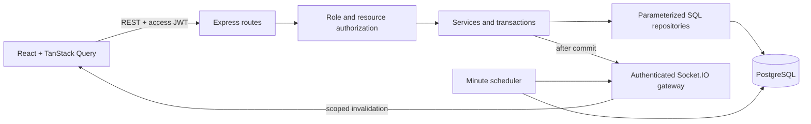
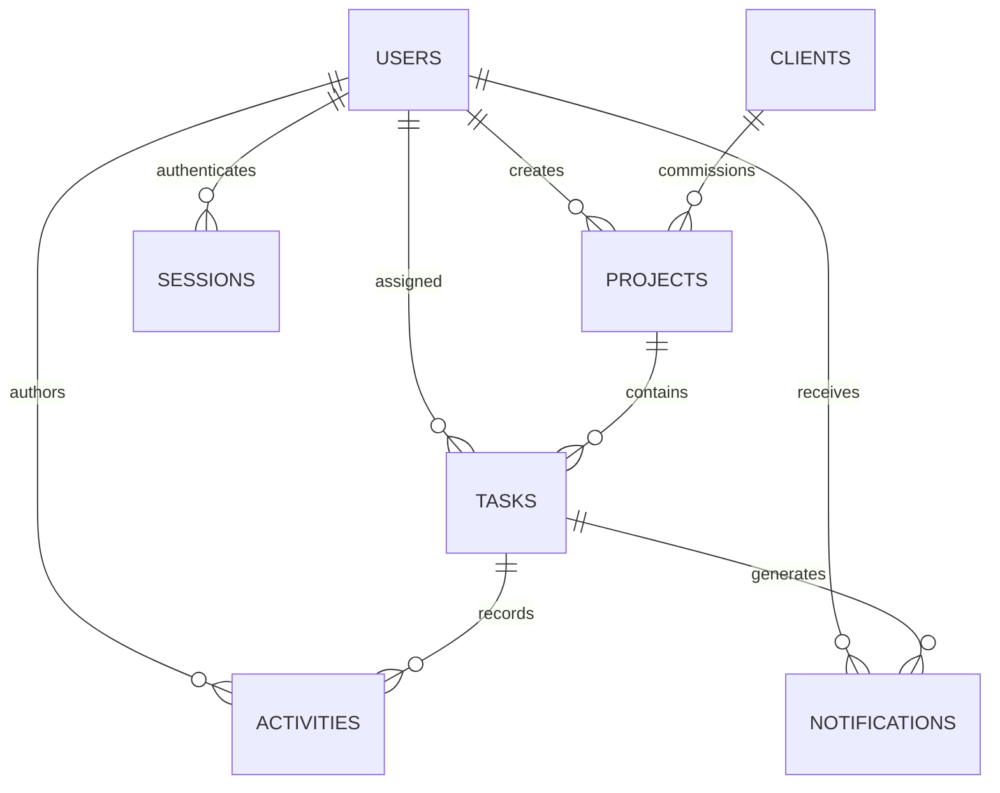

# Velozity workspace

A real-time client project dashboard for an agency team. Admins manage the workspace, project managers own their projects, and developers work on assigned tasks. Authorization applies to database queries and live delivery as well as the interface.

> 📘 **Full Architecture & Specifications**: See [PROJECT_BLUEPRINT.md](file:///c:/Projects/Velozity-Assignment/PROJECT_BLUEPRINT.md) for the complete 20-page production blueprint, ERD, API specs, Socket.IO architecture, RBAC rules, and checklist. For multi-agent continuation guidelines, see [AGENTS.md](file:///c:/Projects/Velozity-Assignment/AGENTS.md) and [HANDOFF.md](file:///c:/Projects/Velozity-Assignment/HANDOFF.md).

Built with React, TypeScript, Vite, Express, PostgreSQL, Socket.IO, and Zod. This repository was developed with AI assistance; it does not claim independent manual authorship. The personal assessment reflection is intentionally not fabricated.

## Run locally

Requires Node.js 22.12+ (verified with Node 24) and npm. Run commands from the repository root.

```sh
npm ci
npm run setup:local
npm run db:local
```

Keep the database terminal open. In a second terminal:

```sh
npm run db:migrate
npm run db:seed
npm run dev
```

Open **http://localhost:5173**. Use `localhost`, matching the configured request origin. The API runs on port 4000 and local PostgreSQL on 55432. `setup:local` generates secrets in ignored `apps/server/.env` and preserves existing configuration. The local database helper downloads through npm, runs native PostgreSQL bound to loopback, and stores data in ignored `.local/postgres`. It does not install a system service. Stop it with Ctrl+C; the data persists.

The seed command deliberately refuses a nonempty database so it cannot erase existing work. Run it once after migration. To use an existing PostgreSQL server instead, set `DATABASE_URL` in `apps/server/.env` and skip `db:local`. Do not run the development helper for production.

### Demo accounts

Every seeded account uses the **`SEED_PASSWORD` value in your local `apps/server/.env`**. Passwords are generated at setup; there is no universal password in the repository. For a hosted assessment demo, share the demo-only password separately with the reviewer and isolate the database from real client data.

| Role            | Email                  |
| --------------- | ---------------------- |
| Admin           | `admin@velozity.test`  |
| Project manager | `maya@velozity.test`   |
| Project manager | `james@velozity.test`  |
| Developer       | `arjun@velozity.test`  |
| Developer       | `sofia@velozity.test`  |
| Developer       | `ankita@velozity.test` |
| Developer       | `priya@velozity.test`  |

Seed data includes 3 clients, 3 projects split between the two managers, 18 tasks with varied states/priorities, 6 overdue tasks, activity, and notifications.

## Commands

| Command                 | Purpose                                                                  |
| ----------------------- | ------------------------------------------------------------------------ |
| `npm run dev`           | Build shared contracts and start API and Vite                            |
| `npm run build`         | Type-check and compile shared package, server, and client                |
| `npm run typecheck`     | TypeScript verification                                                  |
| `npm test`              | Isolated integration suite using the PGlite PostgreSQL engine            |
| `npm run test:postgres` | Same suite against configured native PostgreSQL, in a temporary schema   |
| `npm run test:e2e`      | Chromium workflows against the running seeded app                        |
| `npm run db:migrate`    | Apply pending SQL migrations transactionally                             |
| `npm run db:seed`       | Populate an empty database                                               |
| `npm run format:check`  | Check source formatting                                                  |
| `npm start`             | Run compiled API; start from this root so the workspace loads its `.env` |

Before the browser suite, run `npx playwright install chromium` and start the seeded API/frontend. Browser tests use `SEED_PASSWORD` from `apps/server/.env`. They create and clean up one test client/project and change/restore a demo task status; activity records from those changes remain. Use disposable demo data. Native database tests create their own uniquely named schema and drop only that schema afterward. Set `TEST_DATABASE_URL` when running `npm test` in CI to use a PostgreSQL service instead of PGlite.

## Access rules

| Capability                  | Admin                    | Project manager                          | Developer                                                      |
| --------------------------- | ------------------------ | ---------------------------------------- | -------------------------------------------------------------- |
| Manage users and clients    | All                      | Read client and active developer options | No                                                             |
| Read projects               | All                      | Created by that manager                  | Projects containing assigned tasks; counts scoped to own tasks |
| Create/edit/delete projects | All                      | Create and manage own                    | No                                                             |
| Create/assign/edit tasks    | All                      | Within own projects                      | No                                                             |
| Change task status          | All                      | Within own projects                      | Assigned tasks only                                            |
| Activity and catch-up       | All                      | Own projects                             | Currently assigned tasks only                                  |
| Notifications               | Own inbox                | Own inbox                                | Own inbox                                                      |
| Online-user count           | Live distinct-user count | No                                       | No                                                             |

Managers may select shared client contacts to create a project. Developers do not receive client directories or team directories. Resource denials use 404 to avoid confirming a guessed ID. Admin user deletion means deactivation, retaining activity attribution; self-deactivation and self-demotion are blocked. Role changes are blocked while a user still owns projects or has assigned tasks. A deactivated user loses sessions and cannot receive new assignments.

## How the system fits together



- `packages/shared/src/index.ts`: request schemas and response types.
- `apps/server/src/modules/auth`: authentication, token rotation, and session persistence.
- `apps/server/src/modules/work`: HTTP routes, business transactions, scope predicates, and SQL queries.
- `apps/server/src/realtime`: WebSocket authentication, delivery authorization, and presence.
- `apps/server/src/jobs`: overdue task processing and session cleanup.
- `apps/server/migrations`: ordered, transactional SQL schema migrations.
- `apps/web/src`: pages, reusable forms, query cache, session management, and socket lifecycle.
- `apps/server/tests`, `tests/e2e`: integration and browser verification.

Express 5 keeps async HTTP handling straightforward. SQL is an explicitly permitted assessment option; parameterized queries are isolated in repository/database modules, never assembled from request-provided column names. This avoids an unnecessary ORM layer while making ownership joins and transactional behavior visible. See [Express error handling](https://expressjs.com/en/guide/error-handling/) and [node-postgres transactions](https://node-postgres.com/features/transactions).

### Authentication

Passwords are salted and hashed with Node's scrypt. Access JWTs expire after 10 minutes and stay in browser memory. Refresh JWTs expire after 7 days and use an HttpOnly cookie restricted to `/api/auth`; only their SHA-256 hashes are stored. Distinct signing keys, issuer, audience, signature algorithm, expiration, and server-side session state are checked. Refresh rotates the session while existing access tokens remain valid until expiration; replay and logout revoke access throughout the token family. The browser shares one refresh promise across simultaneous failed requests and uses Web Locks to serialize refreshes across tabs where supported.

Every mutation checks the exact `Origin`, including login and refresh, protecting cookie-backed operations from cross-site requests. Production cookies are Secure. CORS permits only `APP_ORIGIN`. Login/refresh and general APIs have separate rate limits. Request bodies are bounded and schema-validated. Errors use `{ "error": { "code": "...", "message": "..." } }`, with safe field details where appropriate. Unexpected failures are logged with request IDs; cookies and credentials are redacted.

### Activity, catch-up, and presence

A task mutation locks the task and writes its activity and related notification in the same transaction. Status updates include a version to reject stale writes. An advisory lock serializes event-producing transactions so increasing activity IDs also follow commit order, avoiding a cursor that skips a late-committing transaction.

Socket.IO uses **WebSocket transport only**, with no polling fallback. Clients cannot choose rooms. The gateway checks current sessions and task visibility before sending cache invalidations to connected viewers. No hidden task content travels in those events; scoped REST endpoints supply fresh records. Reassignments also invalidate the previous developer's view and remove obsolete assignment notifications. Socket.IO was chosen for connection lifecycle and reconnection support ([transport options](https://socket.io/docs/v4/server-options/)).

On connection/reconnection and returning to a visible tab, the browser calls `/api/activities/catchup?after=<cursor>`. The database returns the newest 20 visible events after the cursor in ascending ID order. Each event has a stable ID. The client then replaces affected cached views, avoiding duplicate insertion. This implements the requested last-20 recovery, not an unlimited offline event archive. The same role predicates protect normal activity and catch-up queries.

Presence counts unique users, not tabs. Only admins receive the count. Sockets disconnect when tokens expire; sessions are rechecked on delivery and every 15 seconds, and the client refreshes before reconnecting.

### Database and indexes



| Index                                 | Query it supports                             |
| ------------------------------------- | --------------------------------------------- |
| Unique user email                     | Login lookup and duplicate-account prevention |
| Project creator and client            | Manager ownership and client relationships    |
| Task assignee/status                  | Developer task filters and authorization      |
| Task project/status, project/priority | Project task views and summaries              |
| Partial task due date, excluding Done | Upcoming work and overdue scans               |
| Activity project/ID and task/ID       | Ordered role-filtered catch-up                |
| Notification user/read state/date     | Recipient inbox and unread count              |
| Session family, user, and expiry      | Replay revocation, deactivation, cleanup      |

The job runs on startup and every minute in UTC. It reconciles overdue flags independently of page loads and clears obsolete flags for completed/rescheduled tasks. Repeated runs make no further changes. A single-process `node-cron` job keeps this assignment deployable without Redis. When the process restarts, the startup scan catches missed schedules. Date filters and due-date inputs use UTC; “this week” is Monday through Sunday UTC.

## Docker

Copy root `.env.example` to root `.env` and replace all credential placeholders with generated values. Then:

```sh
docker compose up --build -d
docker compose exec api node dist/db/seed.js
```

Open http://localhost:8080. The web container proxies REST and WebSocket traffic to the API. The database is private to the Compose network and uses a persistent volume. This local Compose configuration uses HTTP; it is not an HTTPS production deployment. The API image runs as the non-root `node` user, has a database-backed health check, and excludes development dependencies. Docker configuration has not been executed on the development machine because Docker is unavailable.

## Deployment

See [docs/DEPLOYMENT.md](docs/DEPLOYMENT.md) for Vercel frontend settings and the separate persistent backend. No public deployment or GitHub push is implied by the local build. Do not put server secrets into `VITE_*` variables: they are included in the browser bundle.

## Known boundaries

- Designed for one API instance. Presence, rate limiting, and live connections are in memory. Multiple instances need shared presence/rate limiting, a Socket.IO adapter, and coordinated job execution.
- The database is durable; live emission is best effort after commit. Reconnect and tab visibility restore views. Guaranteed delivery during an uninterrupted connection would require a transactional outbox with retries.
- Task lists paginate at 20; notifications show the latest 50 with a separate complete unread count; projects and directory lists are currently unpaginated.
- The app has no self-service registration, password recovery, email delivery, or file uploads. Admins create accounts. These were outside the supplied functional requirements.
- Production HTTPS/cookies, backups/restoration, deployed performance, and container execution still need environment-specific verification. Local tests are not a claim of production certification.
- The supplied documents report an assessment restriction on AI tools. Confirm submission eligibility with the company; this README records implementation behavior rather than inventing a personal assessment narrative.

For agent continuation, read [AGENTS.md](AGENTS.md) and [HANDOFF.md](HANDOFF.md).
